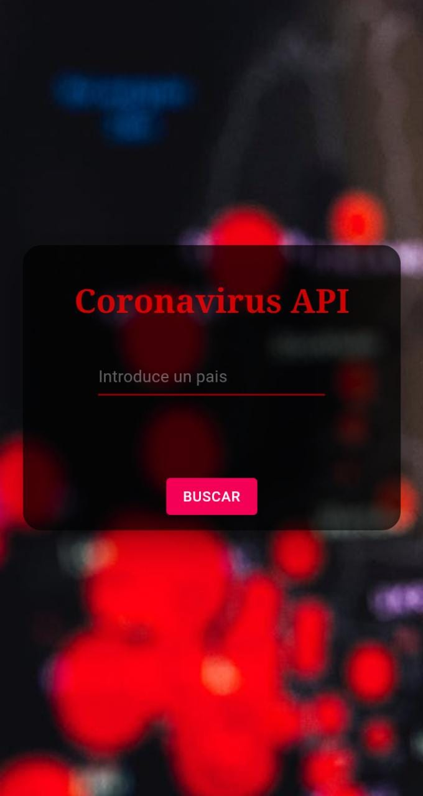
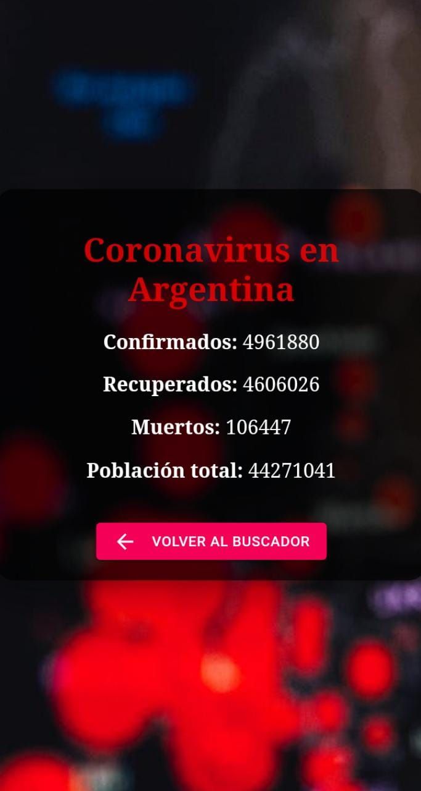

# Coronavirus API

Aplicación informativa del coronavirus filtrando por paises utilizando la API de mmediagroup y los estilos con Material UI.

[Sitio web](https://franco954.github.io/Coronavirus-API/) 

